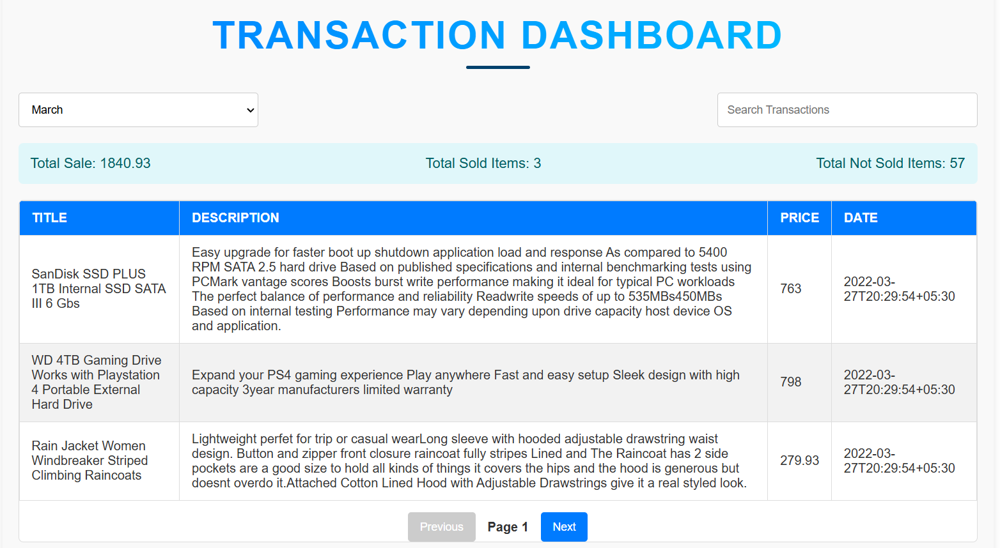
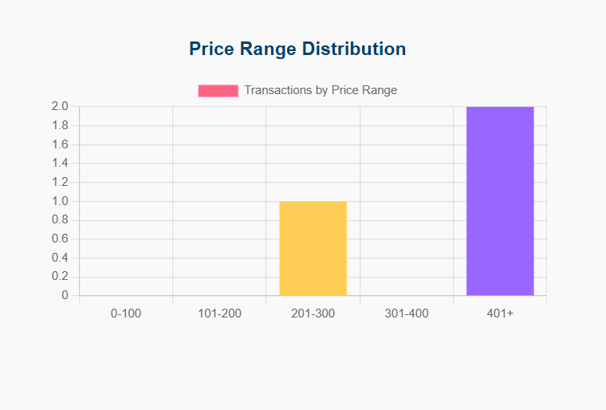
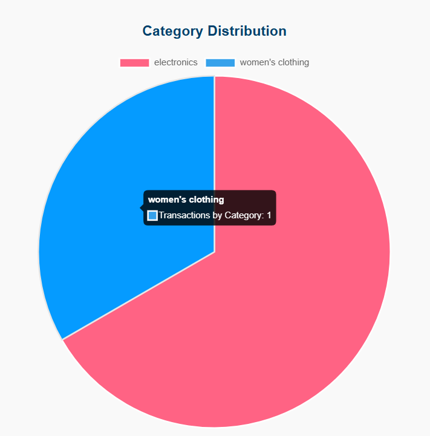

# 🧾 Transaction Dashboard  

A dynamic and user-friendly web application for visualizing transaction data, providing detailed insights through interactive tables and charts.  

## 🚀 Features  
- **Search & Filter:** Filter transactions by month and keyword.  
- **Statistics Overview:** Displays total sales, sold items, and unsold items.  
- **Pagination Support:** Navigate through large datasets with ease.  
- **Data Visualization:**  
  - Bar Chart: Visualizes price distribution across categories.  
  - Pie Chart: Represents category distribution.  

### 📦 Installation & Usage  
1. Clone the repository:  
   ```bash
   git clone https://github.com/dhairyasheel2105/Roxiler-Assessment.git  
   cd transaction-dashboard  
2. Install dependencies:  
   ```bash
   npm install
3. Start the development server:  
   ```bash
   npm start
4. Run the backend server:  
   ```bash
      Ensure your backend service is running on http://localhost:5000
## 🛠 Usage
1. Select a month and search for transactions using the input field.
2. View transaction data with pagination support.
3. Analyze statistics and explore data visualizations.
## 🔌 API Endpoints
- /api/transactions: Fetches paginated transactions based on month and search.
- /api/statistics: Provides transaction statistics for the selected month.
- /api/bar-chart: Returns data for the bar chart visualization.
- /api/pie-chart: Returns data for the pie chart visualization.
## 📊 Tech Stack
- Frontend: React.js
- Charting Library: Chart.js
- Backend: Node.js with Express
- API: Axios
## 📸 Screenshots  

### 🖥️ Dashboard View  
  

### 📊 Bar Chart  
  

### 🍕 Pie Chart  
  

## 🤝 Contributions
 Contributions are always welcome! Please follow these steps:
1. Fork the project.
2. Create a new feature branch (git checkout -b feature-branch-name).
3. Commit your changes (git commit -m 'Add some feature').
4. Push to the branch (git push origin feature-branch-name).
5. Open a pull request.
## 🧑‍💻 Author  

**Dhairyasheel Balasaheb Ingale**  

- [GitHub](https://github.com/dhairyasheel2105)  
- [LinkedIn](https://www.linkedin.com/in/dhairyasheel-ingale2105/)  


**Let me know if you want to customize any specific section!**
